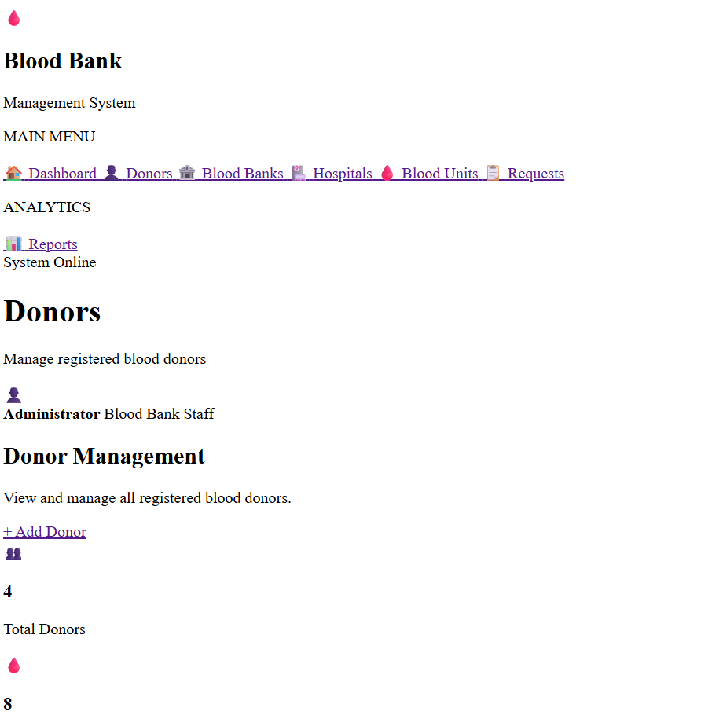
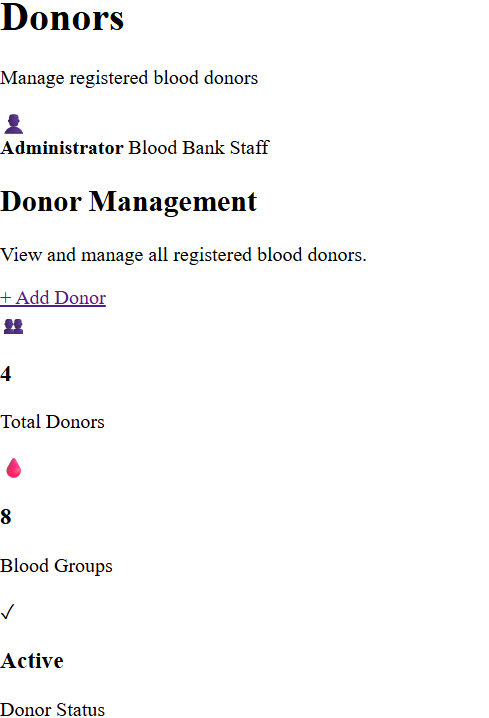
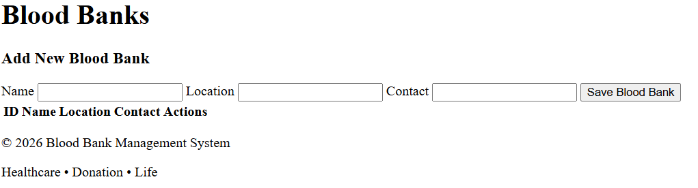
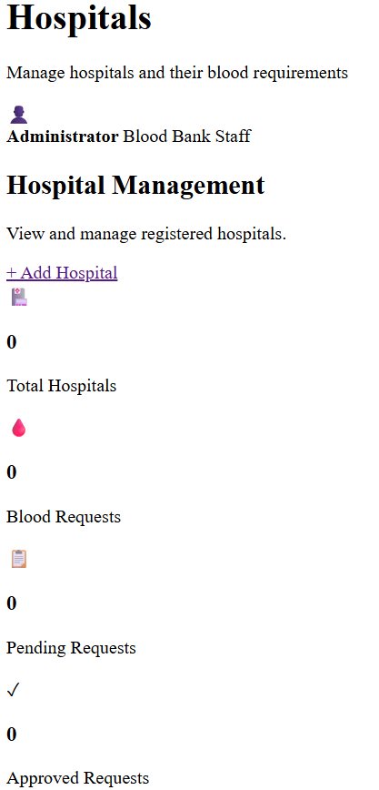
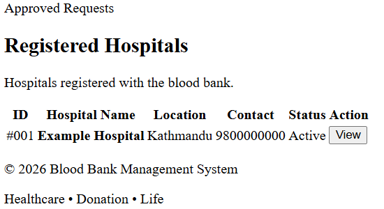
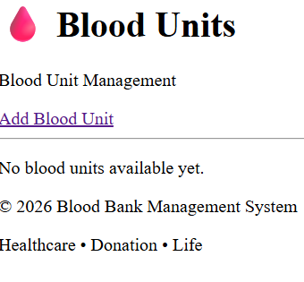
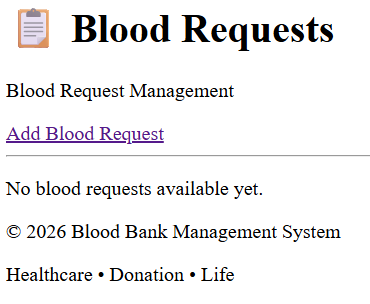
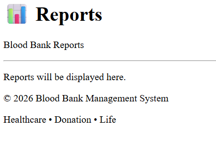

# Blood Bank Management System
## Enterprise Application Development Report

---

**Student Name:** Kumud Ratna Dangol  
**Course/Module:** Database Management Systems (DBMS)  
**Lecturer:** Bikash Khadka  
**Institution:** KFA Business School  
**Submission Date:** September 2026  

---

## Table of Contents

1. [System Proposal](#1-system-proposal)
2. [Web Components Design](#2-web-components-design)
3. [Web Page Navigation Diagram](#3-web-page-navigation-diagram)
4. [Business Layer Design](#4-business-layer-design)
5. [Database Access Layer Design](#5-database-access-layer-design)
6. [Application Overview](#6-application-overview)
7. [Project Plan](#7-project-plan)
8. [UML Diagrams](#8-uml-diagrams)
9. [System Architecture](#9-system-architecture)
10. [Database Design](#10-database-design)
11. [Application Screenshots](#11-application-screenshots)
12. [User Manual](#12-user-manual)
13. [Installation Manual](#13-installation-manual)

---

## 1. System Proposal

### 1.1 Background

Blood banks are critical healthcare infrastructure, responsible for collecting, storing, and distributing blood to hospitals and patients in need. Managing blood inventory manually is error-prone, inefficient, and potentially life-threatening when records are lost or outdated. A digital Blood Bank Management System eliminates these risks by centralising donor records, blood unit inventory, hospital requests, and fulfillment tracking in a single, integrated application.

### 1.2 Problem Statement

Traditional blood bank operations face several challenges:
- No centralised tracking of blood units across multiple storage locations
- Difficulty matching blood requests from hospitals to available inventory
- No automatic expiry detection for stored blood units
- Manual record-keeping leads to errors and delays in critical situations

### 1.3 Proposed Solution

This project proposes a **Python-based Enterprise Web Application** for Blood Bank Management using:
- **Django** as the web framework (backend)
- **Oracle Database** as the persistent data store
- **Django REST Framework (DRF)** to expose a REST API
- **HTML/CSS/JavaScript** as the web-based client (frontend)

The system enables full Create, Read, Update, and Delete (CRUD) operations on all entities, supports navigational and complex relational queries, and includes a background task that automatically detects and marks expired blood units.

### 1.4 Scope

The system manages the following core entities:
- **Donors** — individuals who donate blood
- **Blood Banks** — storage facilities holding blood units
- **Hospitals** — institutions that request blood
- **Blood Units** — individual units of collected blood
- **Blood Requests** — formal requests from hospitals for blood
- **Request Fulfillments** — records linking requests to the specific units that fulfilled them

---

## 2. Web Components Design

### 2.1 Technologies Used

| Component | Technology | Purpose |
|---|---|---|
| Backend Framework | Django 6.1 (Python) | Handles HTTP requests, routing, ORM, admin |
| REST API | Django REST Framework 3.18 | Serializes data, exposes API endpoints |
| Database | Oracle Database | Persistent relational data storage |
| ORM | Django ORM | Maps Python model classes to Oracle tables |
| Frontend | HTML5 + CSS3 + JavaScript | Client-side GUI and API interaction |
| Admin Interface | Django Admin | Built-in admin panel for data management |
| Background Tasks | Python threading module | Asynchronous expiry check task |

### 2.2 REST API Design

The API follows RESTful conventions:
- `GET /api/{resource}/` — list all records
- `POST /api/{resource}/` — create a new record
- `GET /api/{resource}/{id}/` — retrieve a specific record
- `PUT /api/{resource}/{id}/` — update a specific record
- `DELETE /api/{resource}/{id}/` — delete a specific record

Special endpoints:
- `GET /api/donors/{id}/blood-units/` — navigational query 1
- `GET /api/banks/{id}/units/` — navigational query 2
- `GET /api/hospitals/{id}/requests/` — navigational query 3
- `GET /api/reports/hospital/{id}/trace/` — complex query 1
- `GET /api/reports/bank-inventory/` — complex query 2
- `POST /api/tasks/expire-units/` — background task trigger

### 2.3 Serializers (Data Transfer Objects)

DRF serializers act as DTOs, converting model instances to/from JSON. Each model has a corresponding serializer class defined in `serializers.py`. Additional read-only computed fields (e.g. `donor_name`, `bank_name`) are included in some serializers to enrich API responses with related entity data, removing the need for extra client-side lookups.

---

## 3. Web Page Navigation Diagram

```
http://127.0.0.1:8000/
│
├── /donors/          → Donors Page        (List, Add, Edit, Delete donors)
├── /banks/           → Blood Banks Page   (List, Add, Edit, Delete banks)
├── /hospitals/       → Hospitals Page     (List, Add, Edit, Delete hospitals)
├── /units/           → Blood Units Page   (List, Add, Edit, Delete units)
├── /requests/        → Requests Page      (List, Add, Edit, Delete requests)
├── /reports/         → Reports Page       (Complex queries + background task)
│
├── /admin/           → Django Admin Panel (Full admin interface)
│
└── /api/             → REST API Root
    ├── /donors/
    ├── /donors/{id}/
    ├── /donors/{id}/blood-units/
    ├── /banks/
    ├── /banks/{id}/
    ├── /banks/{id}/units/
    ├── /hospitals/
    ├── /hospitals/{id}/
    ├── /hospitals/{id}/requests/
    ├── /units/
    ├── /units/{id}/
    ├── /requests/
    ├── /requests/{id}/
    ├── /fulfillments/
    ├── /fulfillments/{id}/
    ├── /reports/hospital/{id}/trace/
    ├── /reports/bank-inventory/
    └── /tasks/expire-units/
```

All frontend pages share a common navigation bar (defined in `base.html`) giving one-click access to every section.

---

## 4. Business Layer Design

### 4.1 Overview

The business layer is implemented as a set of **service classes** in `bloodbank/services.py`. Each service class groups related business operations for one entity. Views never interact with the ORM directly — they always go through the service layer, ensuring a clean separation between presentation, business logic, and data access.

### 4.2 Service Classes

| Service Class | Responsibility |
|---|---|
| `DonorService` | CRUD for donors + navigational query 1 |
| `BloodBankService` | CRUD for blood banks + navigational query 2 |
| `HospitalService` | CRUD for hospitals + navigational query 3 |
| `BloodUnitService` | CRUD for blood units |
| `BloodRequestService` | CRUD for blood requests |
| `RequestFulfillmentService` | CRUD for fulfillments + auto-marks linked unit as "Used" on creation |
| `ReportService` | Complex queries 1 & 2, and background task logic |

### 4.3 Business Rules Implemented

- When a `RequestFulfillment` is created, the linked `BloodUnit` status is automatically changed to `Used`
- The expiry background task finds all `BloodUnit` records where `expiry_date` is in the past and status is not already `Expired`, and updates them to `Expired`
- Blood group choices are validated at the serializer level (A+, A-, B+, B-, AB+, AB-, O+, O-)

### 4.4 Background / Asynchronous Task

The `expire_old_units()` method in `ReportService` is the core expiry logic. It is invoked by `run_expire_units_task()` in `tasks.py`, which runs it on a **separate Python thread** using the `threading.Thread` class. This means when a client POSTs to `/api/tasks/expire-units/`, the server responds immediately with `202 Accepted` while the database update continues in the background — satisfying the assignment's asynchronous processing requirement without requiring external message brokers.

---

## 5. Database Access Layer Design

### 5.1 ORM Overview

The application uses **Django's ORM** (Object Relational Mapper) to interact with Oracle Database. Each database table is represented by a Python class in `bloodbank/models.py` that extends `django.db.models.Model`. Django translates ORM operations into Oracle-compatible SQL automatically.

### 5.2 Key ORM Patterns Used

**Foreign Keys:**
```python
donor = models.ForeignKey(Donor, on_delete=models.CASCADE, related_name='blood_units')
```
This creates a `DONOR_ID` foreign key column in `BLOOD_UNIT` and enables reverse lookups via `donor.blood_units.all()`.

**Filtering across relationships (double underscore syntax):**
```python
RequestFulfillment.objects.filter(request__hospital_id=hospital_id)
```
This joins `REQUEST_FULFILLMENT` → `BLOOD_REQUEST` → `HOSPITAL` in a single query.

**Annotation (SQL-level aggregation):**
```python
BloodBank.objects.annotate(
    total_units=Count('blood_units'),
    available_units=Count('blood_units', filter=Q(blood_units__status='Available'))
)
```
This performs `COUNT(*) GROUP BY` at the database level rather than in Python.

**select_related (SQL JOIN optimisation):**
```python
RequestFulfillment.objects.filter(...).select_related('unit__donor', 'request')
```
Pre-fetches related objects in a single SQL query instead of N+1 separate queries.

### 5.3 Migrations

Django migrations track all schema changes as versioned files in `bloodbank/migrations/`. Three migration files were generated:
- `0001_initial.py` — creates DONOR and BLOOD_BANK
- `0002_hospital_bloodunit.py` — creates HOSPITAL and BLOOD_UNIT
- `0003_bloodrequest_requestfulfillment.py` — creates BLOOD_REQUEST and REQUEST_FULFILLMENT

---

## 6. Application Overview

The Blood Bank Management System is a three-tier web application:

**Tier 1 — Presentation Layer:**
HTML/CSS/JavaScript frontend pages that call the REST API using the browser's `fetch()` API. A shared `api.js` helper provides reusable `apiGet()`, `apiPost()`, `apiPut()`, and `apiDelete()` functions used by every page.

**Tier 2 — Business/Application Layer:**
Django REST Framework API views (`views.py`) receive HTTP requests, delegate to service classes (`services.py`) for business logic, use serializers (`serializers.py`) to convert data to/from JSON, and return HTTP responses.

**Tier 3 — Data Layer:**
Django ORM model classes (`models.py`) map to Oracle Database tables. All database interaction goes through the ORM — no raw SQL is written in application code.

---

## 7. Project Plan

| Phase | Activity | Status |
|---|---|---|
| Analysis | Understand requirements, choose scenario | Complete |
| Design | Design database schema, E-R diagram, class diagram, page wireframes | Complete |
| Implementation — Database | Define Oracle tables via Django ORM models and migrations | Complete |
| Implementation — API | Build serializers, service layer, API views, URL routing | Complete |
| Implementation — Frontend | Build HTML/JS pages for each entity and the reports page | Complete |
| Testing | Test all CRUD operations, 5 queries, background task via browser and API | Complete |
| Documentation | Write report (this document), export SQL scripts | Complete |
| Deployment | Final test on clean environment, zip and submit | Pending |

---

## 8. UML Diagrams

### 8.1 Class Diagram

```
+------------------+        +---------------------+
|     Donor        |        |     BloodBank        |
+------------------+        +---------------------+
| donor_id (PK)    |        | bank_id (PK)         |
| name             |        | name                 |
| blood_group      |        | location             |
| dob              |        | contact              |
| contact          |        +---------------------+
| address          |                  |
| last_donation_   |                  |
| date             |                  |
+------------------+                  |
         |                            |
         | 1                          | 1
         |                            |
         | *                          | *
+------------------+------------------+
|              BloodUnit              |
+-------------------------------------+
| unit_id (PK)                        |
| donor_id (FK → Donor)               |
| bank_id (FK → BloodBank)            |
| blood_group                         |
| collection_date                     |
| expiry_date                         |
| status                              |
+-------------------------------------+
         |
         | *
         |
         | 1
+----------------------+        +------------------+
| RequestFulfillment   |        |    Hospital      |
+----------------------+        +------------------+
| fulfillment_id (PK)  |        | hospital_id (PK) |
| request_id (FK)      |        | name             |
| unit_id (FK)         |        | location         |
| fulfilled_date       |        | contact          |
+----------------------+        +------------------+
         |                               |
         | *                             | 1
         |                               |
         | 1                             | *
+----------------------+
|    BloodRequest      |
+----------------------+
| request_id (PK)      |
| hospital_id (FK)     |
| blood_group          |
| units_requested      |
| status               |
| request_date         |
+----------------------+

Service Classes:
+-------------------+   +--------------------+   +------------------+
| DonorService      |   | BloodBankService   |   | HospitalService  |
| + get_all()       |   | + get_all()        |   | + get_all()      |
| + get_by_id()     |   | + get_by_id()      |   | + get_by_id()    |
| + create()        |   | + create()         |   | + create()       |
| + update()        |   | + update()         |   | + update()       |
| + delete()        |   | + delete()         |   | + delete()       |
| + get_units_      |   | + get_units_       |   | + get_requests_  |
|   by_donor()      |   |   by_bank()        |   |   by_hospital()  |
+-------------------+   +--------------------+   +------------------+

+----------------------+   +----------------------+   +------------------+
| BloodUnitService     |   | BloodRequestService  |   | ReportService    |
| + get_all()          |   | + get_all()          |   | + get_donor_     |
| + get_by_id()        |   | + get_by_id()        |   |   hospital_      |
| + create()           |   | + create()           |   |   trace()        |
| + update()           |   | + update()           |   | + get_bank_      |
| + delete()           |   | + delete()           |   |   inventory_     |
+----------------------+   +----------------------+   |   summary()      |
                                                      | + expire_old_    |
                                                      |   units()        |
                                                      +------------------+
```

### 8.2 Entity-Relationship (E-R) Diagram

```
[DONOR] ----< [BLOOD_UNIT] >---- [BLOOD_BANK]
                   |
                   |
             [REQUEST_FULFILLMENT]
                   |
                   |
             [BLOOD_REQUEST] >---- [HOSPITAL]

Relationships:
- DONOR (1) ——— (*) BLOOD_UNIT         (one donor donates many units)
- BLOOD_BANK (1) ——— (*) BLOOD_UNIT    (one bank stores many units)
- HOSPITAL (1) ——— (*) BLOOD_REQUEST   (one hospital makes many requests)
- BLOOD_REQUEST (1) ——— (*) REQUEST_FULFILLMENT
- BLOOD_UNIT (1) ——— (*) REQUEST_FULFILLMENT
```

---

## 10. Database Design

### 10.1 Table Descriptions

#### DONOR
Stores information about blood donors.

| Column | Type | Constraints | Description |
|---|---|---|---|
| DONOR_ID | NUMBER(11) | PK, Identity | Unique donor identifier |
| NAME | NVARCHAR2(100) | NOT NULL | Full name of the donor |
| BLOOD_GROUP | NVARCHAR2(3) | NOT NULL | Blood group (A+, A-, B+, B-, AB+, AB-, O+, O-) |
| DOB | DATE | NOT NULL | Date of birth |
| CONTACT | NVARCHAR2(15) | NOT NULL | Phone number |
| ADDRESS | NVARCHAR2(255) | NULL | Residential address |
| LAST_DONATION_DATE | DATE | NULL | Date of most recent donation |

#### BLOOD_BANK
Stores information about blood storage facilities.

| Column | Type | Constraints | Description |
|---|---|---|---|
| BANK_ID | NUMBER(11) | PK, Identity | Unique blood bank identifier |
| NAME | NVARCHAR2(100) | NOT NULL | Name of the blood bank |
| LOCATION | NVARCHAR2(255) | NOT NULL | Physical location/address |
| CONTACT | NVARCHAR2(15) | NOT NULL | Contact number |

#### HOSPITAL
Stores information about hospitals that request blood.

| Column | Type | Constraints | Description |
|---|---|---|---|
| HOSPITAL_ID | NUMBER(11) | PK, Identity | Unique hospital identifier |
| NAME | NVARCHAR2(100) | NOT NULL | Name of the hospital |
| LOCATION | NVARCHAR2(255) | NOT NULL | Physical location/address |
| CONTACT | NVARCHAR2(15) | NOT NULL | Contact number |

#### BLOOD_UNIT
Stores individual blood unit records, linking donors and blood banks.

| Column | Type | Constraints | Description |
|---|---|---|---|
| UNIT_ID | NUMBER(11) | PK, Identity | Unique unit identifier |
| DONOR_ID | NUMBER(11) | FK → DONOR | The donor who provided this unit |
| BANK_ID | NUMBER(11) | FK → BLOOD_BANK | The bank storing this unit |
| BLOOD_GROUP | NVARCHAR2(3) | NOT NULL | Blood group of the unit |
| COLLECTION_DATE | DATE | NOT NULL | Date the unit was collected |
| EXPIRY_DATE | DATE | NOT NULL | Date the unit expires |
| STATUS | NVARCHAR2(10) | NOT NULL | Available / Reserved / Expired / Used |

#### BLOOD_REQUEST
Records blood requests made by hospitals.

| Column | Type | Constraints | Description |
|---|---|---|---|
| REQUEST_ID | NUMBER(11) | PK, Identity | Unique request identifier |
| HOSPITAL_ID | NUMBER(11) | FK → HOSPITAL | The requesting hospital |
| BLOOD_GROUP | NVARCHAR2(3) | NOT NULL | Required blood group |
| UNITS_REQUESTED | NUMBER(11) | NOT NULL | Number of units needed |
| STATUS | NVARCHAR2(10) | NOT NULL | Pending / Approved / Rejected / Fulfilled |
| REQUEST_DATE | DATE | NOT NULL | Date the request was made (auto-set) |

#### REQUEST_FULFILLMENT
Links blood requests to specific blood units used to fulfil them.

| Column | Type | Constraints | Description |
|---|---|---|---|
| FULFILLMENT_ID | NUMBER(11) | PK, Identity | Unique fulfillment identifier |
| REQUEST_ID | NUMBER(11) | FK → BLOOD_REQUEST | The request being fulfilled |
| UNIT_ID | NUMBER(11) | FK → BLOOD_UNIT | The blood unit used |
| FULFILLED_DATE | DATE | NOT NULL | Date the fulfillment was recorded (auto-set) |

### 10.2 The Five Required Queries

#### Navigational Query 1 — Blood units by donor
Returns all blood units donated by a specific donor.
```python
BloodUnit.objects.filter(donor_id=donor_id)
```
Endpoint: `GET /api/donors/{id}/blood-units/`

#### Navigational Query 2 — Blood units by bank
Returns all blood units currently held at a specific blood bank.
```python
BloodUnit.objects.filter(bank_id=bank_id)
```
Endpoint: `GET /api/banks/{id}/units/`

#### Navigational Query 3 — Requests by hospital
Returns all blood requests made by a specific hospital.
```python
BloodRequest.objects.filter(hospital_id=hospital_id)
```
Endpoint: `GET /api/hospitals/{id}/requests/`

#### Complex Query 1 — Donor-to-hospital trace (5 entities)
For a given hospital, traces all donor names and blood groups through the fulfillment chain: Hospital → BloodRequest → RequestFulfillment → BloodUnit → Donor.
```python
RequestFulfillment.objects.filter(
    request__hospital_id=hospital_id
).select_related('unit__donor', 'request')
```
Endpoint: `GET /api/reports/hospital/{id}/trace/`

#### Complex Query 2 — Bank inventory summary (4 entities)
For each blood bank, shows total units, available units, and units reserved for pending/approved requests: BloodBank → BloodUnit → RequestFulfillment → BloodRequest.
```python
BloodBank.objects.annotate(
    total_units=Count('blood_units'),
    available_units=Count('blood_units', filter=Q(blood_units__status='Available'))
)
```
Endpoint: `GET /api/reports/bank-inventory/`

---

## 11. Application Screenshots

*(Insert screenshots of each page here — use screenshots taken during testing)*

- **Donors Page** — showing donor list table, Add/Edit form, and Edit/Delete buttons

- **Blood Banks Page** — showing blood bank list and form

- **Hospitals Page** — showing hospital list and form


- **Blood Units Page** — showing unit list with donor/bank dropdowns


- **Requests Page** — showing request list with hospital dropdown and status


- **Reports Page** — showing complex query results and background task trigger


- **Django Admin** — showing all 6 models in the admin panel

- **DRF Browsable API** — showing a sample API endpoint response


---

## 12. User Manual

### 12.1 Starting the Application

1. Ensure Oracle Database is running
2. Open a terminal in the project root folder
3. Activate the virtual environment: `.\venv\Scripts\activate`
4. Start the server: `python manage.py runserver`
5. Open a browser and go to: `http://127.0.0.1:8000/donors/`

### 12.2 Using the Donors Page (`/donors/`)

**Viewing Donors:** The page loads all donors automatically in the table.

**Adding a Donor:**
1. Fill in the form fields: Name, Blood Group, Date of Birth, Contact, Address (optional), Last Donation Date (optional)
2. Click **Save Donor**
3. The new donor appears in the table immediately

**Editing a Donor:**
1. Click **Edit** next to any donor in the table
2. The form fills with the donor's current data
3. Make changes and click **Save Donor**

**Deleting a Donor:**
1. Click **Delete** next to any donor
2. Confirm the deletion in the popup
3. The donor is removed from the table

### 12.3 Using the Blood Banks Page (`/banks/`)

Same pattern as Donors. Fields: Name, Location, Contact.

### 12.4 Using the Hospitals Page (`/hospitals/`)

Same pattern as Donors. Fields: Name, Location, Contact.

### 12.5 Using the Blood Units Page (`/units/`)

**Adding a Blood Unit:**
1. Select a Donor from the dropdown (populated from existing donors)
2. Select a Blood Bank from the dropdown
3. Select Blood Group, enter Collection Date and Expiry Date
4. Status defaults to Available
5. Click **Save Blood Unit**

### 12.6 Using the Requests Page (`/requests/`)

**Adding a Blood Request:**
1. Select a Hospital from the dropdown
2. Select the required Blood Group
3. Enter Units Requested (number)
4. Status defaults to Pending
5. Click **Save Request**

### 12.7 Using the Reports Page (`/reports/`)

**Donor-Hospital Trace (Complex Query 1):**
1. Enter a Hospital ID in the input field
2. Click **Run Trace**
3. Results show all donors whose blood was used to fulfil that hospital's requests

**Bank Inventory Summary (Complex Query 2):**
1. Click **Load Inventory**
2. Results show all blood banks with total units, available units, and reserved counts

**Expire Blood Units (Background Task):**
1. Click **Trigger Expiry Check**
2. The server responds with `202 Accepted`
3. Any blood units past their expiry date are automatically marked as Expired
4. Refresh the Blood Units page to see updated statuses

### 12.8 Using the Admin Panel (`/admin/`)

1. Go to `http://127.0.0.1:8000/admin/`
2. Log in with your superuser credentials
3. All 6 models are listed under the **BLOODBANK** section
4. Click any model to view, add, edit, or delete records
5. Use the search and filter options on each list page

---

## 13. Installation Manual

### 13.1 Prerequisites

| Software | Version | Download |
|---|---|---|
| Python | 3.x | https://www.python.org |
| Oracle Database | 19c or later | https://www.oracle.com |
| Oracle SQL Developer | Any recent version | https://www.oracle.com |
| Visual Studio Code | Any recent version | https://code.visualstudio.com |
| Git (optional) | Any | https://git-scm.com |

### 13.2 Step-by-Step Installation

**Step 1: Extract the project**
- Unzip the submitted project archive to a folder, e.g. `C:\Blood Bank\`

**Step 2: Create and activate a virtual environment**
```bash
cd "C:\Blood Bank"
python -m venv venv
.\venv\Scripts\activate
```

**Step 3: Install dependencies**
```bash
pip install django djangorestframework oracledb
```

**Step 4: Set up the Oracle Database**
1. Open Oracle SQL Developer
2. Connect to your Oracle instance
3. Create a new user/schema:
```sql
CREATE USER bloodbank IDENTIFIED BY your_password;
GRANT CONNECT, RESOURCE, DBA TO bloodbank;
```
4. Open a new SQL Worksheet connected as `bloodbank`
5. Run the provided `create_tables.sql` script to create all 6 tables

**Step 5: Configure the database connection**

Open `config/settings.py` and update the `DATABASES` setting:
```python
DATABASES = {
    'default': {
        'ENGINE': 'django.db.backends.oracle',
        'NAME': 'localhost:1521/orclpdb',
        'USER': 'bloodbank',
        'PASSWORD': 'your_password',
    }
}
```
Replace `localhost:1521/orclpdb` with your Oracle host, port, and service name.

**Step 6: Run Django migrations**
```bash
python manage.py migrate
```

**Step 7: Create a superuser (for admin access)**
```bash
python manage.py createsuperuser
```
Follow the prompts to set a username and password.

**Step 8: Start the development server**
```bash
python manage.py runserver
```

**Step 9: Access the application**

| URL | Purpose |
|---|---|
| http://127.0.0.1:8000/donors/ | Donors management page |
| http://127.0.0.1:8000/banks/ | Blood Banks management page |
| http://127.0.0.1:8000/hospitals/ | Hospitals management page |
| http://127.0.0.1:8000/units/ | Blood Units management page |
| http://127.0.0.1:8000/requests/ | Blood Requests management page |
| http://127.0.0.1:8000/reports/ | Reports and background task |
| http://127.0.0.1:8000/admin/ | Django Admin panel |
| http://127.0.0.1:8000/api/ | REST API root |

### 13.3 Project File Structure

```
Blood Bank/
├── bloodbank/
│   ├── migrations/         # Django migration files
│   ├── admin.py            # Admin panel registration
│   ├── models.py           # ORM model classes (6 tables)
│   ├── serializers.py      # DRF serializers (DTOs)
│   ├── services.py         # Business service layer
│   ├── tasks.py            # Background task
│   ├── views.py            # API views + page views
│   ├── urls.py             # API URL routing
│   └── page_urls.py        # Frontend page URL routing
├── config/
│   ├── settings.py         # Django settings
│   └── urls.py             # Project-level URL routing
├── templates/
│   ├── base.html           # Shared layout/navbar
│   ├── donors.html
│   ├── banks.html
│   ├── hospitals.html
│   ├── units.html
│   ├── requests.html
│   └── reports.html
├── static/
│   ├── css/
│   │   └── style.css       # Application stylesheet
│   └── js/
│       ├── api.js          # Shared API helper functions
│       ├── donors.js
│       ├── banks.js
│       ├── hospitals.js
│       ├── units.js
│       ├── requests.js
│       └── reports.js
├── create_tables.sql       # Oracle DDL scripts
├── manage.py               # Django management script
└── report.md               # This report
```

### 13.4 Troubleshooting

| Problem | Solution |
|---|---|
| "Site can't be reached" | Run `python manage.py runserver` — the server must be running |
| Oracle connection error | Check `DATABASES` settings in `settings.py` match your Oracle credentials |
| "Table does not exist" | Run `python manage.py migrate` to create tables |
| Admin login fails | Run `python manage.py createsuperuser` to create an admin account |
| Static files not loading | Ensure `STATICFILES_DIRS` is set correctly in `settings.py` |

---

*End of Report*

**Student:** Kumud Ratna Dangol  
**Institution:** KFA Business School  
**Module:** Database Management Systems  
**Lecturer:** Bikash Khadka  
